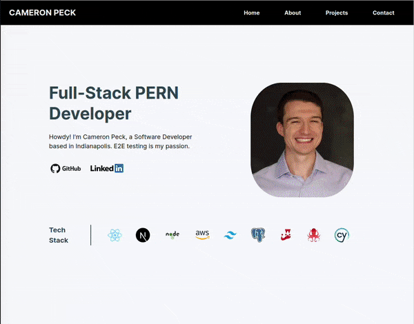

# Personal Portfolio Site

A personal portfolio site to display coding projects and information about me.

## Techonologies Used

- Next.js
- React
- TypeScript
- TailwindCSS
- Node
- Firestore
- Jest
- React Testing Library
- Cypress
- GitHub Actions
- Vercel (for deployment)

## Why Use These Technologies?

### Frontend

- Next.js / React: Great frameworks for a SPA. I wanted to get this up and running as quickly as possible for job applications.
- TailwindCSS: I like the freedom that Tailwind gives while still increasing the speed I write CSS.
- TypeScript: Type reinforcement and method autofill are huge QOL improvements while working.

### Backend

- Node: Ships default with Next.js.
- Firestore: Great serverless option for noSQL database storage. Easy to setup and get running.

### Testing / CI / CD

- Jest / RTL: Wonderful for writing maintainable tests. Works with actual DOM nodes. Nice.
- Cypress: Time travel is fantastic for debugging. Tests typical user flow through the application.
- GitHub Actions: Runs my testing suite on pull requests.
- Vercel: Standard deployment platform for Next.js applications. Works great.

## Live Deployment

Check out the site --> https://portfolio-cam-peck.vercel.app/

## Preview

### Site Overview



## Development

### System Requirements

- Node.js
- Docker
- NPM

### Getting Started

1. Clone the repository.

```
git clone https://github.com/cam-peck/portfolio.git
cd portfolio
```

2. Open the repository in the provided devcontainer. It may take awhile to build on first open.

3. Install all dependencies with NPM.

```
npm install
```

4. Make a copy of the provided `env.example` file. Name your copy `.env`.

```
cp env.example .env
```

5. Make an account on Firebase (or use an exisiting account) and add your config information to the `.env` file.

6. Start the project. Once running, you can view the application by opening http://localhost:3000 in your browser.

```
npm run dev
```

7. If you'd like to run the React Testing Library tests...

```
npm run test
```

8. If you'd like to run the Cypress tests...

```
npm run cypress
```
